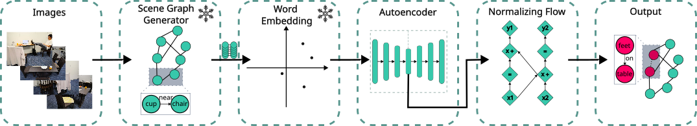

# BUSSARD: Normalizing Flows for Bijective Universal Scene-Specific Anomalous Relationship Detection

[](https://arxiv.org/abs/2603.16645)

BUSSARD detects anomalous object relationships in indoor scenes by combining scene graph generation with normalizing flows. It embeds object-relation-object triplets from scene graphs using word embeddings and an autoencoder, then uses a RealNVP flow to score each triplet by its likelihood under a learned normal distribution. Anomalous relationships, like 'plate-on-chair', receive low likelihood and are flagged as outliers.
 
## Pipeline
 


## Abstract

We propose Bijective Universal Scene-Specific Anomalous Relationship Detection (BUSSARD), a normalizing flow-based model for detecting anomalous relations in scene graphs, generated from images. Our work follows a multimodal approach, embedding object and relationship tokens from scene graphs with a language model to leverage semantic knowledge from the real world. A normalizing flow model is used to learn bijective transformations that map object-relation-object triplets from scene graphs to a simple base distribution (typically Gaussian), allowing anomaly detection through likelihood estimation. We evaluate our approach on the SARD dataset containing office and dining room scenes. Our method achieves around 10% better AUROC results compared to the current state-of-the-art model, while simultaneously being five times faster. Through ablation studies, we demonstrate superior robustness and universality, particularly regarding the use of synonyms, with our model maintaining stable performance while the baseline shows 17.5% deviation. This work demonstrates the strong potential of learning-based methods for relationship anomaly detection in scene graphs.

## Citation

If you use this work, please cite:

```bibtex
@misc{schween2026bussard,
  title         = {{BUSSARD}: Normalizing Flows for Bijective Universal Scene-Specific Anomalous Relationship Detection},
  author        = {Schween, Melissa and Kruse, Mathis and Rosenhahn, Bodo},
  year          = {2026},
  eprint        = {2603.16645},
  archivePrefix = {arXiv},
  primaryClass  = {cs.CV},
  url           = {https://arxiv.org/abs/2603.16645}
}
```
 
Once published at CVPR, please use:
 
```bibtex
@inproceedings{schween2026bussard,
  title     = {{BUSSARD}: Normalizing Flows for Bijective Universal Scene-Specific Anomalous Relationship Detection},
  author    = {Schween, Melissa and Kruse, Mathis and Rosenhahn, Bodo},
  booktitle = {Proceedings of the IEEE/CVF Conference on Computer Vision and Pattern Recognition (CVPR)},
  year      = {2026}
}
```

## Code

The code will follow soon.